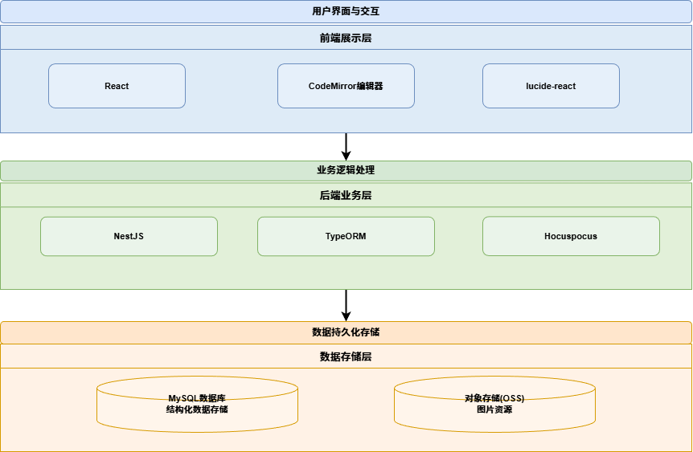
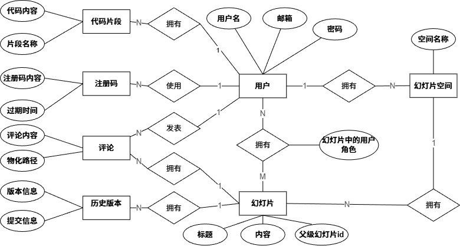
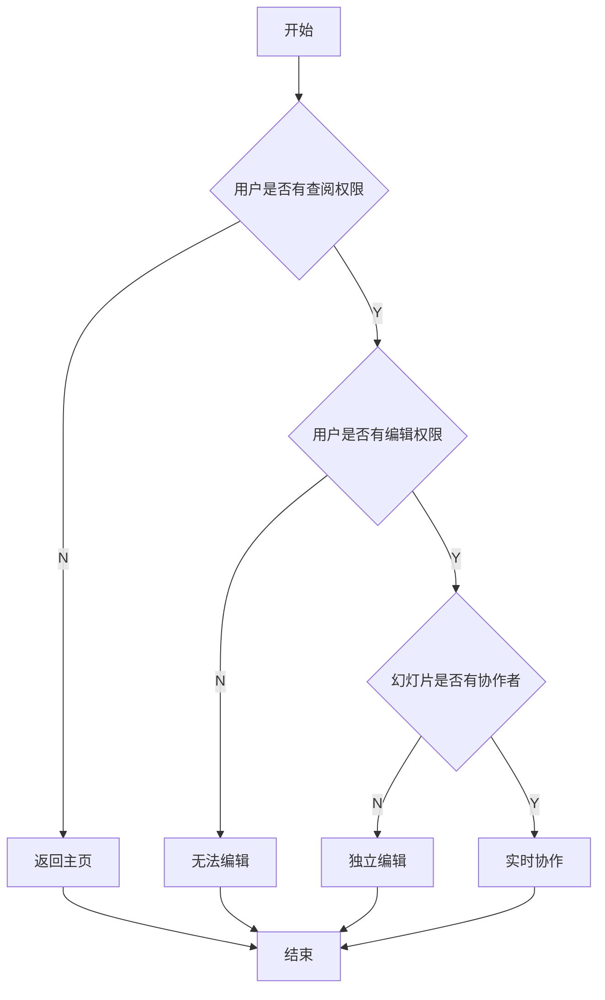
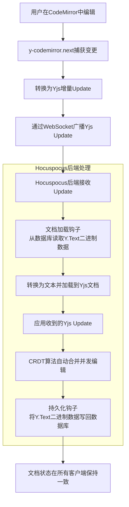
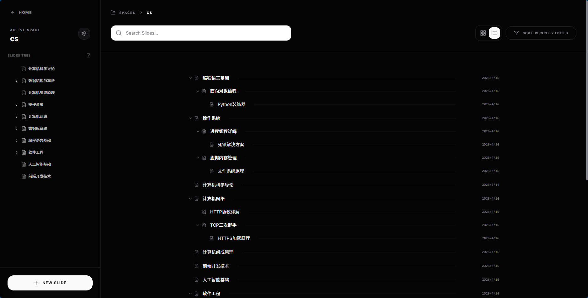
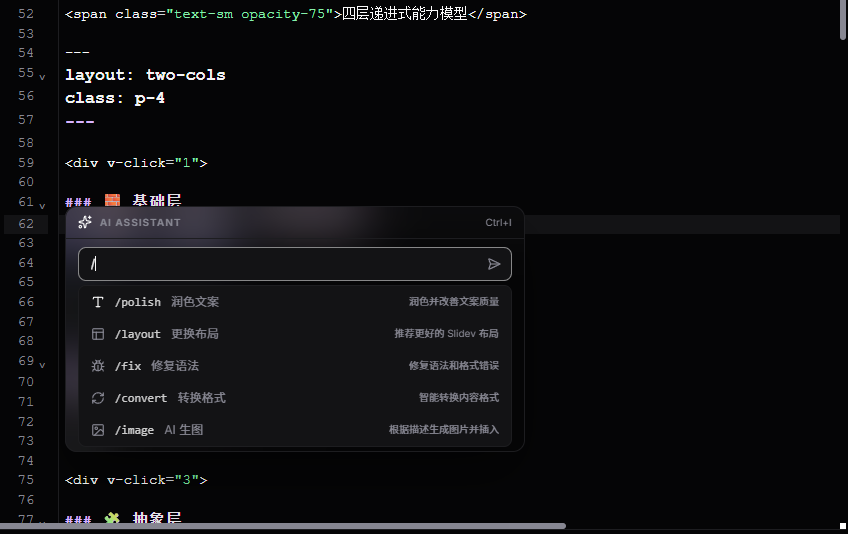
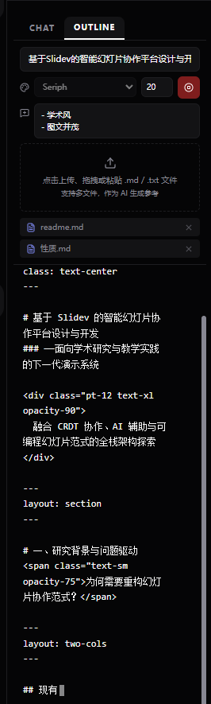
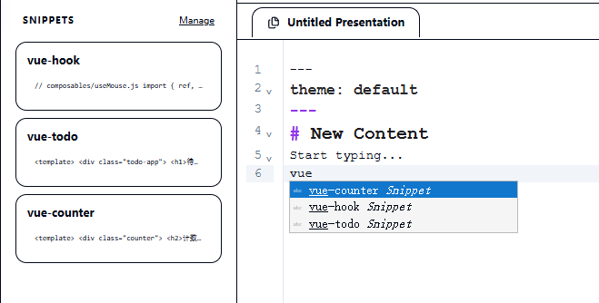

<br>

<div>
<!-- <div class="font-serif"> -->

# 浙江传媒学院毕业设计答辩

</div>


<div class="font-serif w-full py-8 flex flex-col gap-4 text-center">
  <div class="text-3xl font-semibold">基于Slidev的智能幻灯片协作平台设计与开发</div> 
  <!-- <div class="text-3xl font-semibold">媒体工程学院</div>  -->
  <div class="text-2xl">指导教师：张浩斌</div>
  <div class="text-2xl">答辩人：林君阳</div>
</div>


<!-- <div class="pt-12">
  <span @click="next" class="px-2 p-1 rounded cursor-pointer hover:bg-white hover:bg-opacity-10">
    Press Space for next page <carbon:arrow-right class="inline"/>
  </span>
</div> -->
<!-- 居中 -->


<br>


---
section: 选题缘起
---


# 选题介绍

<Item title="课题名称">
基于Slidev的智能幻灯片协作平台设计与开发
</Item>

- [介绍](http://ppt.agiantii.top)
<br>
<Item title="Slidev">
[Slidev] (slide + dev, /slaɪdɪv/) 是一个为开发者设计的基于 Web 的幻灯片制作工具。它帮助您以<span v-mark.circle.orange="1"> Markdown </span>的形式专注于编写幻灯片的内容，并制作出具有<span v-mark.underline.red="2">交互式演示功能的、高度可自定义</span>的幻灯片。

</Item>

- [Slidev-guide](https://cn.sli.dev/guide/)

---

# 研究背景

幻灯片是表达演讲者想法和便于沟通的重要工具，传统的幻灯片工具如Microsoft PowerPoint和Apple Keynote采用“所见即所得”的编辑方式，
虽然这种方式在许多地方符合直觉且容易上手，但在排版使用、媒体资源管理、代码展示等方面仍然存在许多不便，
需要用户花费较多精力在布局排版上，而非内容创作。

近年来，基于Web的轻量化幻灯片工具逐渐出现在人们的视野，
如Reveal.js、Marp、Slidev等工具支持用Markdown语法编写幻灯片内容，还可以结合现代Web技术栈实现许多有趣且丰富的交互效果。

其中，<span v-mark.red="1">Slidev（slide + dev）作为一个基于Web的幻灯片制作工具，不仅支持Vue语法，而且支持丰富的自定义插件，可以让用户以Markdown的形式专注于编写幻灯片的内容，并制作出具有交互式演示功能的、高度可自定义的幻灯片。</span>

综合以上背景，作者设计与开发一个基于Slidev的智能幻灯片协作平台，支持实时协作技术、权限管理系统、AI辅助功能和简单的版本控制。

---

# 选题意义
- 为什么选择用markdown制作PPT
  - 传统PPT制作较为复杂
  - 利用基于markdown的slidev简化制作流程,让制作者专注于内容本身
  - 同时相对于latex beamer等工具，markdown语法更为简单易用,且基于vue的slidev有更好的扩展性
- 为什么需要协作平台
  - 组会、团队项目等场景下，多人协作制作PPT，这样文本资源的统一管理和版本控制就显得尤为重要，同时因为一般的ppt制作也不需要git等复杂的版本控制工具，所以需要一个简单易用的协作平台
  - 同时将mardown所需要的图片、主体模板等资源进行统一放在云端上管理，方便多人使用
  - 利用AI能提升制作ppt的效率
- 市面上已经有了许多基于AI的ppt制作工具，做这个有什么意义
  - 无法方便地进行多人协作
  - 无法方便地进行文本资源的统一管理和版本控制
  - 诸如kimi、豆包等工具，所提供的模板和功能较为有限，有些时候需要自己的模板才方便，比如组会、毕设答辩报告等模板

---
section: 系统需求分析
---

#  系统简要功能性需求分析


- **🎨 智能编辑器**  
  配备**专为 Slidev 语法优化的代码编辑器**，支持 Markdown 高亮、代码提示、代码片段插入及快捷键操作，**实时预览**幻灯片渲染效果。

- **👥 实时协同编辑**  
- **🔐 四级权限管理（RBAC）**  
  基于角色的权限控制（**Owner / Editor / Commenter / Viewer**）
- **🧠 AI 辅助创作**  
  接入大语言模型 API，**一键生成幻灯片内容与文生图**；支持上传文本文件作为参考文档，**对话式或内联式调用 AI**

- **⏱️ 版本控制**  

- **📁 树形文档结构 + 拖拽管理**  
  幻灯片空间采用**树形文档结构**，支持**拖拽调整文档层级与顺序**，同时可**快速修改或删除文档**，文档组织一目了然。

- **💬 团队评论**  

<!-- - 配有适配于Slidev语法的代码编辑器，支持Markdown语法高亮、代码提示、代码片段插入、快捷键使用等，
  并且可以实时预览Slidev渲染的幻灯片。
- 支持多用户协同编辑，显示其他协作者正在编辑的光标区域。
- 设计基于RBAC的四级权限管理系统（owner/editor/commenter/viewer），实现合适的文档权限访问控制。
- 接入大语言模型API，实现幻灯片内容生成、文生图等功能，
  允许用户上传文本文件作为内容生成的参考文档。
  不仅可以支持对话窗口，
  还支持编辑器内联使用，让幻灯片内容创作更简单、快捷。
- 实现简单的、基于快照的版本控制系统，以时间轴的方式显示历史版本，提供版本差异对比和回滚功能。
- 在幻灯片空间中，支持树形文档结构，允许用户用拖拽的方式改变树形文档结构，可以修改、删除文档。
- 支持对幻灯片评论，方便团队协作和交流。 -->

---

# 系统非功能性需求分析

- 作为一个幻灯片协作平台，在常规网络条件下，页面加载与常规请求的响应时间应该在可接受的范围内，并支持一定规模的并发编辑，不会出现内容不一致、过分卡顿的情况。

- 为了让用户能快速上手，尽量实现VSCode的编辑器体验，用合适的功能图标让交互逻辑清晰、直观，同时支持常见的快捷键使用以及调节各个窗口的大小，让幻灯片创作更加便捷、容易上手。同时针对用户对主题的偏好，本平台支持暗色/亮色主题的切换，以黑白配色为主。

- 对于所有核心API请求，都需要通过JWT认证以及权限校验，同时后端需要使用bcrypt对密码加密存储到数据库，在Websocket连接前也需要进行JWT认证和权限校验，保证协作正常。

---
section: 系统设计
---

# 系统技术总体架构

<div class="flex justify-center">

</div>

---

# 数据库设计




---

# RESTful API 核心接口设计


<div class="overflow-auto max-h-90">

| 模块名称         | API 路径前缀                             | 功能描述                       |
|----------------|------------------------------------------|--------------------------------|
| 用户管理         | /api/users/*                             | 用户信息查询、更新、密码重置等     |
| 空间管理         | /api/slide-spaces/*                      | 幻灯片空间的创建、查询、更新等     |
| 代码片段         | /api/snippets/*                          | 代码片段的创建、查询、更新等      |
| 幻灯片管理       | /api/slides/*                            | 幻灯片的创建、预览链接获取等      |
| 幻灯片协作者管理 | /api/slides/:slideId/collaborators/*     | 幻灯片的协作者的权限管理         |
| 版本控制         | /api/versions/*                          | 版本历史查询、版本创建、内容回滚等 |
| 评论系统         | /api/comments/*                          | 评论的增删改查及树形结构管理      |
| AI 辅助         | /api/ai/*                                | AI 内容生成、图像生成、智能建议等 |
| 主题管理         | /api/theme/*                             | 幻灯片主题的查询、更新等         |
| 插件管理         | /api/plugins/*                           | 幻灯片插件的查询、更新等         |
| 注册码管理       | /api/registration-codes/*                | 注册码的生成、查询等            |

</div>
---
section: 核心功能实现
---

# 文档编辑流程

能够依据文档的协作状态
选择独立编辑模式还是实时协作模式。由于建立 WebSocket 连接以及后端文档合并编辑
冲突会有一定的性能开销，这样的设计可以尽可能兼顾性能和用户的使用体验
<div class="overflow-auto max-h-96 w-full">

</div>

---


#  实时协作具体实现

<div class="overflow-auto max-h-96 w-full">



</div>

---

# 后端Hocuspocus提供的生命周期钩子

```ts
 this.server = new Server({
      port: parseInt(wsBasePort, 10),
      // 文档初始化钩子：加载数据文档到服务器内存
      async onLoadDocument(data: onLoadDocumentPayload) {
      },
      // 文档存储钩子：持久化到数据库
      async onStoreDocument(data: onStoreDocumentPayload) {
      },
      // 认证钩子：验证 JWT Token
      async onAuthenticate(data: onAuthenticatePayload) {
      },
      // 连接钩子
      async onConnect(data: onConnectPayload) {
      },
      // 断开连接钩子
      async onDisconnect(data: onDisconnectPayload) {
      },
    });
```

---

# 后端Hocuspocus对生命周期钩子具体实现

由于yjs中文档数据是二进制数据，而数据库存储的是text，当文档加载和持久化时，都要进行相互转化
<div class="overflow-auto max-h-96 w-full">

```ts {*|3-20|14-19|21-36|29-32|37-70|*}
    this.server = new Server({
      port: parseInt(wsBasePort, 10),
      // 文档初始化钩子：加载数据文档到服务器内存
      async onLoadDocument(data: onLoadDocumentPayload) {
        const docName = data.documentName;
        const slideId = self.extractSlideIdFromDocName(docName);
        if (!slideId) {
          throw new Error('无效的文档名称');
        }
        const slide = await self.slidesService.findById(slideId);
        if (!slide) {
          throw new Error('文档不存在');
        }
        const doc = new Y.Doc();
        const yText = doc.getText('codemirror');
        if (slide.content) {
          yText.insert(0, slide.content);
        }
        return doc;
      },
      // 文档存储钩子：持久化到数据库
      async onStoreDocument(data: onStoreDocumentPayload) {
        try {
          const doc = data.document;
          const textType = doc.getText('codemirror');
          const content = textType.toString();
          const docName = data.documentName;     
          // 提取 slideId 从 docName (格式: slide-{id})
          const slideId = self.extractSlideIdFromDocName(docName);
          if (slideId) {
            await self.saveDocumentContent(slideId, content);
          }
        } catch (error) {
          throw error;
        }
      },
      // 认证钩子：验证 JWT Token
      async onAuthenticate(data: onAuthenticatePayload) {
        const { token, documentName } = data;  
        if (!token) {
          throw new Error('未提供认证令牌');
        }
        try {
          const payload = self.jwtService.verify(token);
          const userId = payload.sub || payload.userId;
          const slideId = self.extractSlideIdFromDocName(documentName);
          if (!slideId) {
            throw new Error('无效的文档名称');
          }
          const { role } = await self.collaboratorsService.getMyRole(slideId, userId);
          if (!role) {
            throw new Error('没有访问权限');
          }
          const userPermissions = PERMISSIONS[role];
          const canEdit = userPermissions.includes('edit');
          const canRead = userPermissions.includes('read');
          if (!canRead) {
            throw new Error('没有读取权限');
          }
          if (!canEdit){
            data.connectionConfig.readOnly=true;
          }
          return {
            userId: userId.toString(),
            readOnly: !canEdit,
          };
        } catch (error) {
          throw new Error('认证失败: ' + error.message);
        }
      },
      // 连接钩子
      async onConnect(data: onConnectPayload) {
        // 加载文档内容
        const docName = data.documentName;
        const content = await self.slidesService.findById(parseInt(docName.split('-')[1], 10));
        self.logger.log(`[Hocuspocus] 客户端连接: ${data.documentName}`);
      },
      // 断开连接钩子
      async onDisconnect(data: onDisconnectPayload) {
        self.logger.log(`[Hocuspocus] 客户端断开: ${data.documentName}`);
      },
    });
```
</div>

---

# 实时协作实现效果

<div class="flex justify-center">
<video class="h-90 center" controls>
    <source src="./assets/shared-doc.mkv">
</video>
</div>

---

# 权限管理

<Item title="实现方案" v-click="1">
权限管理系统采用RBAC模型，定义了owner、editor、commenter、viewer四种角色
</Item>

<div v-click="2">

| 角色 | 权限列表 |
|------|----------|
| owner | 查阅，评论，编辑，查看历史，管理，删除 |
| editor | 查阅，评论，编辑，查看历史 |
| commenter | 查阅，评论，查看历史 |
| viewer | 查阅，查看历史 |
</div>

---

# 权限校验核心代码

```ts {*|5|*}
  private validatePermission(
    actualRole: SlideRole | null,
    requiredPermission: AuthPermissions | undefined,
  ): boolean {
      const rolePermissions = PERMISSIONS[actualRole];
      if (rolePermissions.includes(requiredPermission as string)) {
        return true;
      }
      throw new ForbiddenException('您不符合权限要求');
  }
```
<div v-click="1">
```ts 
export const PERMISSIONS: Record<SlideRole, string[]> = {
  owner: ['read', 'comment', 'edit', 'view_history', 'manage', 'delete'],
  editor: ['read', 'comment', 'edit', 'view_history'],
  commenter: ['read', 'comment', 'view_history'],
  viewer: ['read', 'view_history'],
};
```
</div>

---

# 版本控制

版本控制表记录幻灯片的版本历史，<span v-mark.red="1"> 每个版本的幻灯片源码都会完整存为一条记录</span>
，前端使用@type/diff可视化两个版本的差异。

| 字段名         | 数据类型         | 是否允许空 | 说明          |
|---------------|----------------|------------|---------------|
| id            | bigint         | 否         | 版本唯一主键   |
| slide_id      | bigint         | 否         | 所属幻灯片ID   |
| content       | longtext       | 是         | 版本内容快照   |
| commit_msg    | varchar(500)   | 是         | 提交说明       |
| created_by    | bigint         | 否         | 创建者用户ID   |
| created_at    | datetime       | 否         | 创建时间       |

---

# 评论和幻灯片文档树形结构比较


| 比较维度 | 幻灯片文档树 | 评论树 |
| :--- | :--- | :--- |
| **使用场景** | 目录结构频繁拖拽移动|评论树添加后，不需要移动|
| **核心字段** | `parent_id`（自关联） | `reply_id`（父评论ID） + `path`（物化路径） |
| **移动节点** | 仅需更新节点的 `parent_id` | 不需要移动|
| **删除节点及子孙** | 需递归遍历查找所有子节点后逐个删除 | 执行 `LIKE 'path-%'` 即可批量删除|
| **插入新节点** | 直接插入，设置 `parent_id` 即可 | 需先插入获取自增 `id`，再更新 `path = 父path + '-' + id`，需事务保证 |
<!-- | **查询某节点下的所有子孙** | 需递归查询，性能随深度下降 | 通过 `path LIKE 'prefix-%'` 直接索引查询，性能好 | -->


---

# 幻灯片文档树形结构

幻灯片文档的树形结构主要由幻灯片文档的parent\_id字段实现，
parent\_id字段自关联到同表id，实现任意深度的树形结构，根节点的parent\_id为NULL。

本平台支持用户拖拽来调整目录树的结构，此时，目录树结构可能会经常变动。
如果引入物化路径，那么我们每次移动一个节点，都需要更新该节点及其所有子孙节点的path字段，这样会大大增加计算复杂度。
因此，文档树这边只维护parent\_id字段，移动节点的时候只需要修改该记录的父节点引用。
删除文档节点时则通过递归遍历依次删除子节点。
<div class="overflow-auto max-h-96">

| 字段名              | 数据类型         | 是否允许空 | 说明                      |
|---------------------|----------------|------------|---------------------------|
| id                  | bigint         | 否         | 文档唯一主键               |
| title               | varchar(200)   | 否         | 文档标题                  |
| content             | longtext       | 是         | 幻灯片Markdown源码         |
| slide_space_id      | bigint         | 否         | 所属空间ID                |
| parent_id           | bigint         | 是         | 父文档ID，根节点为NULL      |
| allow_comment       | tinyint        | 否         | 是否允许评论（1允许，0禁止） |
| created_by          | bigint         | 否         | 创建者用户ID               |
| is_public           | tinyint        | 否         | 是否公开（0私有，1公开）     |
| is_build            | tinyint        | 否         | 是否已编译生成预览           |
| preview_url         | varchar(255)   | 是         | 编译后预览地址              |
| created_at          | datetime       | 否         | 创建时间                  |
| updated_at          | datetime       | 否         | 最近修改时间               |

</div>

---

# 扁平结构构建树形结构
幻灯片文档的树形结构主要由幻灯片文档的parent\_id字段实现，
后端返回的数据为扁平化的数据，需要由前端构建为树形结构。
```ts
  const buildTree = (nodes: Slide[], parentId: number | null = null): FileTreeNode[] => {
    return nodes
      .filter(node => node.parentId === parentId)
      .map(node => ({
        ...node,
        children: buildTree(nodes, node.id)
      }));
  };
```

---

# 幻灯片文档结构实现效果




---

# 评论树形结构

评论的树形结构是由评论表的parent\_id和path字段共同实现的。

新增评论的path字段由回复的目标评论的path和自身id组成，
而评论的id是自增字段，所以需要先存入新增评论的数据，再构建新增评论的path字段，这两个操作不可中断，
作者使用事务来保证评论创建和字段更新这两个操作是一气呵成的。

删除评论时，
由于在新增评论的时候，已经维护了每个评论的path字段，所以可以使用如DELETE FROM slide\_comments WHERE path LIKE
'1-5-\%'的SQL语句即可实现一键删除该评论以及所有子评论，避免相对复杂的递归删除。
<div class="overflow-auto max-h-90">

| 字段名         | 数据类型          | 是否允许空 | 说明                      |
|----------------|------------------|------------|---------------------------|
| id             | bigint           | 否         | 评论唯一主键               |
| slide_id       | bigint           | 否         | 所属幻灯片ID               |
| user_id        | bigint           | 否         | 评论发表者ID               |
| content        | text             | 否         | 评论正文内容               |
| path           | varchar(1000)    | 否         | 根节点到本节点的物化路径     |
| reply_id       | bigint           | 是         | 父评论ID，顶层评论为NULL     |
| created_at     | datetime         | 否         | 评论发布时间               |

</div>

---

# 智能辅助内容生成

本平台接入通义千问官方的qwen-plus大模型API，能够方便、高效地生成文本内容和图片素材。
不仅支持多轮对话、大纲生成，还支持编辑器内联编辑。
将Slidev官方文档、主题模板以及相关范例加入到AI的知识库中，
让AI生成的内容符合Slidev的Markdown语法。

---
layout: image
---

# AI内联编辑



---

# AI大纲生成

<div class="overflow-auto max-h-90">

</div>

---

# 代码提示

为实现代码提示功能，编辑器挂载时会调用snippetApi.findAll()获取所有用户自定义的代码片段列表，
并注入到CodeMirror的autocompletion配置，之后当用户输入时，就会过滤出snippets数组中name匹配的代码片段。


---
section: 结语
layout: center
class: "text-center"
---

## $Thanks$


<div  class="fixed bottom-0 right-0 m-4 p-3">

Powered by [Slidev](https://cn.sli.dev/guide/) with the [Frankfurt theme](https://github.com/MuTsunTsai/slidev-theme-frankfurt)

</div>