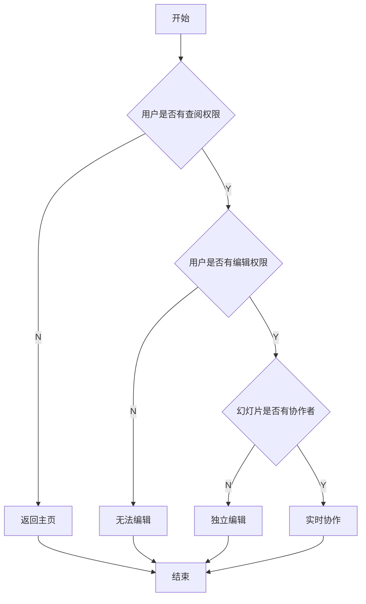
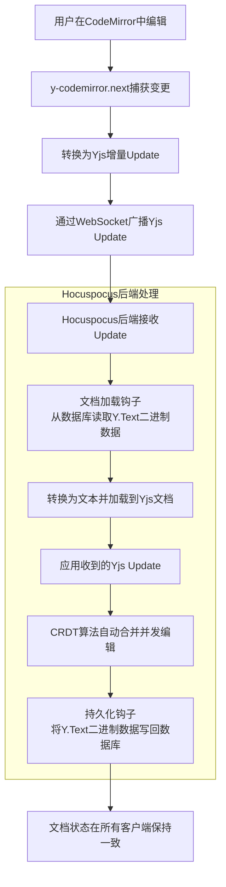

<br>

<div>
<!-- <div class="font-serif"> -->

# 浙江传媒学院毕业设计答辩

</div>


<div class="font-serif w-full py-8 flex flex-col gap-4 text-center">
  <div class="text-3xl font-semibold">基于Slidev的智能幻灯片协作平台设计与开发</div> 
  <!-- <div class="text-3xl font-semibold">媒体工程学院</div>  -->
  <div class="text-2xl">指导教师：张浩斌</div>
  <div class="text-2xl">答辩人：林君阳</div>
</div>


<!-- <div class="pt-12">
  <span @click="next" class="px-2 p-1 rounded cursor-pointer hover:bg-white hover:bg-opacity-10">
    Press Space for next page <carbon:arrow-right class="inline"/>
  </span>
</div> -->
<!-- 居中 -->


<br>


---
section: 选题缘起
---


# 选题介绍

<Item title="课题名称">
基于Slidev的智能幻灯片协作平台设计与开发
</Item>

- [介绍](http://ppt.agiantii.top)
<br>
<Item title="Slidev">
[Slidev] (slide + dev, /slaɪdɪv/) 是一个为开发者设计的基于 Web 的幻灯片制作工具。它帮助您以<span v-mark.circle.orange="1"> Markdown </span>的形式专注于编写幻灯片的内容，并制作出具有<span v-mark.underline.red="2">交互式演示功能的、高度可自定义</span>的幻灯片。

</Item>

- [Slidev-guide](https://cn.sli.dev/guide/)

---

# 选题意义
- 为什么选择用markdown制作PPT
  - 传统PPT制作较为复杂
  - 利用基于markdown的slidev简化制作流程,让制作者专注于内容本身
  - 同时相对于latex beamer等工具，markdown语法更为简单易用,且基于vue的slidev有更好的扩展性
- 为什么需要协作平台
  - 组会、团队项目等场景下，多人协作制作PPT，这样文本资源的统一管理和版本控制就显得尤为重要，同时因为一般的ppt制作也不需要git等复杂的版本控制工具，所以需要一个简单易用的协作平台
  - 同时将mardown所需要的图片、主体模板等资源进行统一放在云端上管理，方便多人使用
  - 利用AI能提升制作ppt的效率
- 市面上已经有了许多基于AI的ppt制作工具，做这个有什么意义
  - 无法方便地进行多人协作
  - 无法方便地进行文本资源的统一管理和版本控制
  - 诸如kimi、豆包等工具，所提供的模板和功能较为有限，有些时候需要自己的模板才方便，比如组会、毕设答辩报告等模板

---
section: 系统需求分析
---

#  系统功能性需求分析
- 配有适配于Slidev语法的代码编辑器，支持Markdown语法高亮、代码提示、代码片段插入、快捷键使用等，
  并且可以实时预览Slidev渲染的幻灯片。
- 支持多用户协同编辑，显示其他协作者正在编辑的光标区域。
- 设计基于RBAC的四级权限管理系统（owner/editor/commenter/viewer），实现合适的文档权限访问控制。
- 接入大语言模型API，实现幻灯片内容生成、文生图等功能，
  允许用户上传文本文件作为内容生成的参考文档。
  不仅可以支持对话窗口，
  还支持编辑器内联使用，让幻灯片内容创作更简单、快捷。
- 实现简单的、基于快照的版本控制系统，以时间轴的方式显示历史版本，提供版本差异对比和回滚功能。
- 在幻灯片空间中，支持树形文档结构，允许用户用拖拽的方式改变树形文档结构，可以修改、删除文档。
- 支持对幻灯片评论，方便团队协作和交流。

---

# 系统非功能性需求分析

- 作为一个幻灯片协作平台，在常规网络条件下，页面加载与常规请求的响应时间应该在可接受的范围内，并支持一定规模的并发编辑，不会出现内容不一致、过分卡顿的情况。

- 为了让用户能快速上手，尽量实现VSCode的编辑器体验，用合适的功能图标让交互逻辑清晰、直观，同时支持常见的快捷键使用以及调节各个窗口的大小，让幻灯片创作更加便捷、容易上手。同时针对用户对主题的偏好，本平台支持暗色/亮色主题的切换，以黑白配色为主。

- 对于所有核心API请求，都需要通过JWT认证以及权限校验，同时后端需要使用bcrypt对密码加密存储到数据库，在Websocket连接前也需要进行JWT认证和权限校验，保证协作正常。

---
section: 系统设计
---

# 系统技术总体架构

<div class="flex justify-center">

</div>

---

# 文档编辑流程

<div class="overflow-auto max-h-96 w-full">

</div>

---
section: 核心功能实现
---

#  实时协作具体实现

<div class="overflow-auto max-h-96 w-full">



</div>


---

# 后端Hocuspocus实现

<div class="overflow-auto max-h-96 w-full">

```ts {3-24|25-44|45-88|*}
    this.server = new Server({
      port: parseInt(wsBasePort, 10),
      // 文档初始化钩子：加载数据文档到服务器内存
      async onLoadDocument(data: onLoadDocumentPayload) {
        const docName = data.documentName;
        const slideId = self.extractSlideIdFromDocName(docName);
        if (!slideId) {
          throw new Error('无效的文档名称');
        }

        const slide = await self.slidesService.findById(slideId);
        if (!slide) {
          throw new Error('文档不存在');
        }

        const doc = new Y.Doc();
        const yText = doc.getText('codemirror');
        if (slide.content) {
          yText.insert(0, slide.content);
          self.logger.debug(`[Hocuspocus] 加载文档 ${docName}, 内容: ${yText.toString().slice(0, 10)} 长度: ${yText.length}`);
        }

        return doc;
      },
      // 文档存储钩子：持久化到数据库
      async onStoreDocument(data: onStoreDocumentPayload) {
        try {
          const doc = data.document;
          const textType = doc.getText('codemirror');
          const content = textType.toString();
          const docName = data.documentName;
          
          self.logger.debug(`[Hocuspocus] 存储文档 ${docName}, 长度: ${textType.length}`);
          
          // 提取 slideId 从 docName (格式: slide-{id})
          const slideId = self.extractSlideIdFromDocName(docName);
          if (slideId) {
            await self.saveDocumentContent(slideId, content);
          }
        } catch (error) {
          self.logger.error('[Hocuspocus] 存储文档失败:', error);
          throw error;
        }
      },
      // 认证钩子：验证 JWT Token
      async onAuthenticate(data: onAuthenticatePayload) {
        const { token, documentName } = data;
        
        self.logger.debug(`[Hocuspocus] 认证请求: ${documentName}`);
        
        if (!token) {
          throw new Error('未提供认证令牌');
        }

        try {
          const payload = self.jwtService.verify(token);
          const userId = payload.sub || payload.userId;
          
          const slideId = self.extractSlideIdFromDocName(documentName);
          if (!slideId) {
            throw new Error('无效的文档名称');
          }

          const { role } = await self.collaboratorsService.getMyRole(slideId, userId);
          if (!role) {
            throw new Error('没有访问权限');
          }

          const userPermissions = PERMISSIONS[role];
          const canEdit = userPermissions.includes('edit');
          const canRead = userPermissions.includes('read');
          
          if (!canRead) {
            throw new Error('没有读取权限');
          }
          if (!canEdit){
            self.logger.warn(`[Hocuspocus] 用户 ${userId} 没有编辑权限`);
            data.connectionConfig.readOnly=true;
          }
          return {
            userId: userId.toString(),
            readOnly: !canEdit,
          };
        } catch (error) {
          self.logger.error('[Hocuspocus] 认证失败:', error.message);
          throw new Error('认证失败: ' + error.message);
        }
      },
      // 连接钩子
      async onConnect(data: onConnectPayload) {
        // 加载文档内容
        const docName = data.documentName;
        const content = await self.slidesService.findById(parseInt(docName.split('-')[1], 10));
        self.logger.log(`[Hocuspocus] 客户端连接: ${data.documentName}`);
      },
      // 断开连接钩子
      async onDisconnect(data: onDisconnectPayload) {
        self.logger.log(`[Hocuspocus] 客户端断开: ${data.documentName}`);
      },
    });
```

</div>
---

# 实时协作实现效果

<div class="flex justify-center">
<video class="h-90 center" controls>
    <source src="./assets/shared-doc.mkv">
</video>
</div>

---

# 权限管理

<Item title="实现方案" v-click="1">
权限管理系统采用RBAC模型，定义了owner、editor、commenter、viewer四种角色
</Item>

<div v-click="2">

| 角色 | 权限列表 |
|------|----------|
| owner | 查阅，评论，编辑，查看历史，管理，删除 |
| editor | 查阅，评论，编辑，查看历史 |
| commenter | 查阅，评论，查看历史 |
| viewer | 查阅，查看历史 |
</div>

---

# 权限校验核心代码

```ts {*|5|*}
  private validatePermission(
    actualRole: SlideRole | null,
    requiredPermission: AuthPermissions | undefined,
  ): boolean {
      const rolePermissions = PERMISSIONS[actualRole];
      if (rolePermissions.includes(requiredPermission as string)) {
        return true;
      }
      throw new ForbiddenException('您不符合权限要求');
  }
```
<div v-click="1">
```ts 
export const PERMISSIONS: Record<SlideRole, string[]> = {
  owner: ['read', 'comment', 'edit', 'view_history', 'manage', 'delete'],
  editor: ['read', 'comment', 'edit', 'view_history'],
  commenter: ['read', 'comment', 'view_history'],
  viewer: ['read', 'view_history'],
};
```
</div>
---
section: 结语
layout: center
class: "text-center"
---

## $Thanks$
