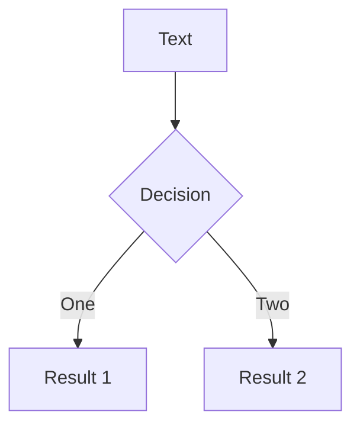
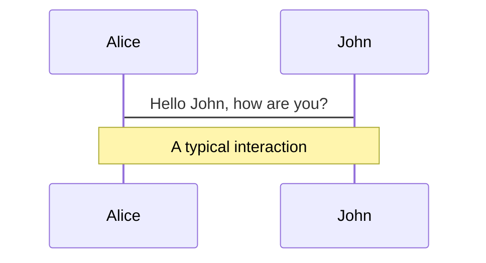
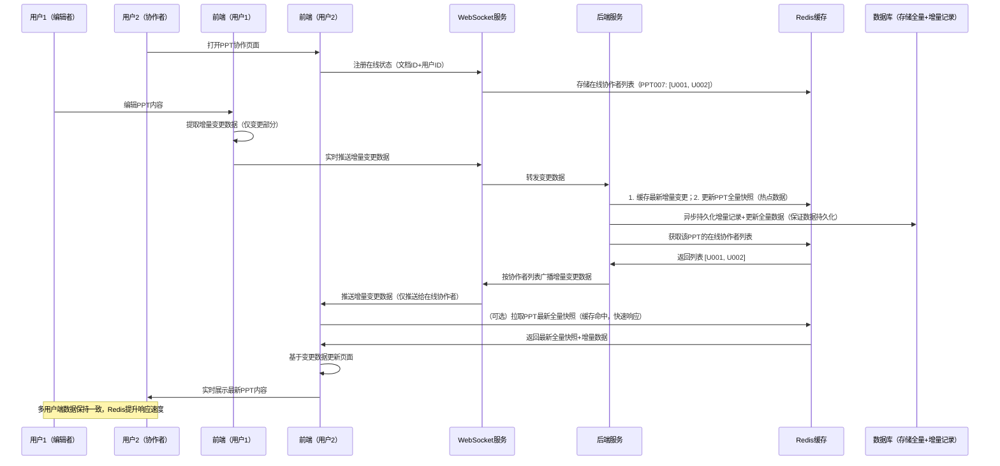
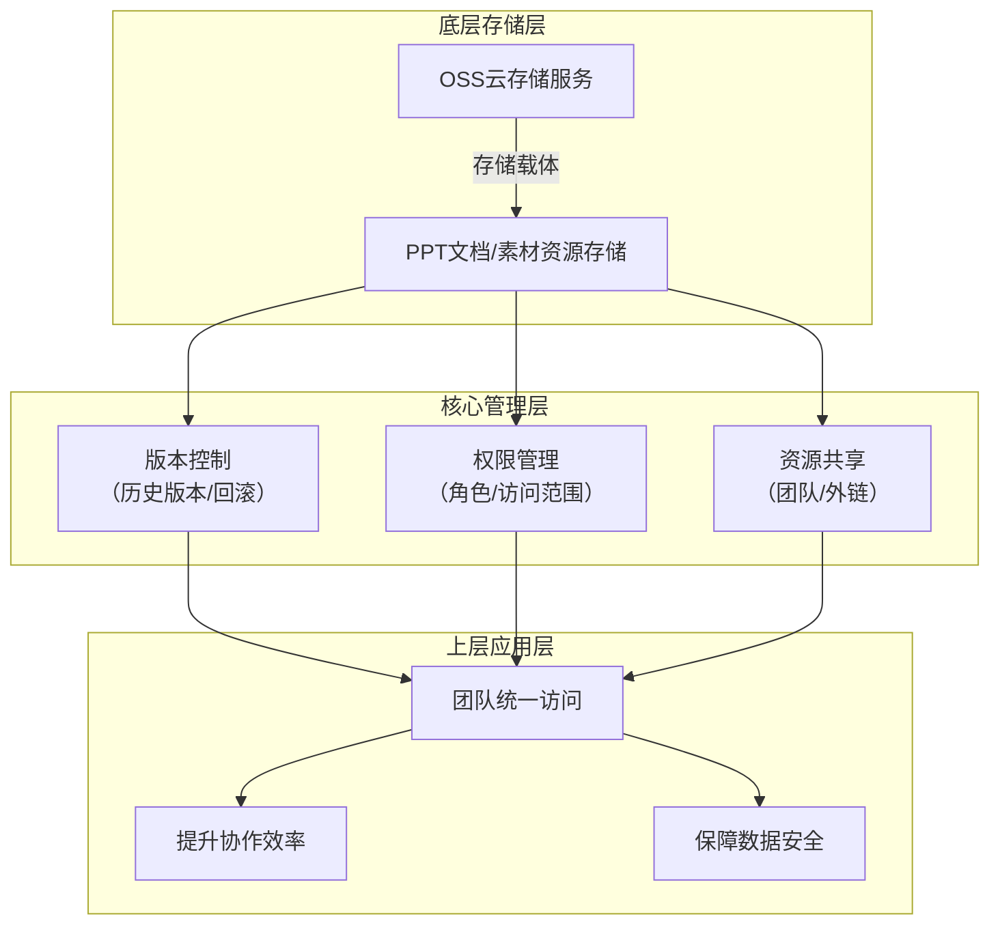
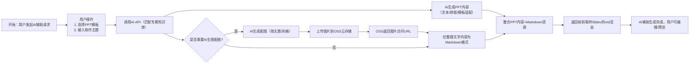

<br>

# 浙江传媒学院开题答辩


<br>

##  agiantii
<br>

#### 媒体工程学院
<!--  -->
<!-- <div class="pt-12">
  <span @click="next" class="px-2 p-1 rounded cursor-pointer hover:bg-white hover:bg-opacity-10">
    Press Space for next page <carbon:arrow-right class="inline"/>
  </span>
</div> -->
<!-- 居中 -->


<br>


---
section: 选题缘起
---
dd

<Toc />
---

# 选题介绍

<Item title="课题名称">
基于Slidev的智能幻灯片协作平台设计与开发
</Item>

- [介绍](http://ppt.agiantii.top)
<br>
<Item title="Slidev">
[Slidev] (slide + dev, /slaɪdɪv/) 是一个为开发者设计的基于 Web 的幻灯片制作工具。它帮助您以<span v-mark.circle.orange="1"> Markdown </span>的形式专注于编写幻灯片的内容，并制作出具有<span v-mark.underline.red="2">交互式演示功能的、高度可自定义</span>的幻灯片。

</Item>

- [Slidev-guide](https://cn.sli.dev/guide/)

---

# 选题意义
- 为什么选择用markdown制作PPT
  - 传统PPT制作较为复杂
  - 利用基于markdown的slidev简化制作流程,让制作者专注于内容本身
  - 同时相对于latex beamer等工具，markdown语法更为简单易用,且基于vue的slidev有更好的扩展性
- 为什么需要协作平台
  - 组会、团队项目等场景下，多人协作制作PPT，这样文本资源的统一管理和版本控制就显得尤为重要，同时因为一般的ppt制作也不需要git等复杂的版本控制工具，所以需要一个简单易用的协作平台
  - 同时将mardown所需要的图片、主体模板等资源进行统一放在云端上管理，方便多人使用
  - 利用AI能提升制作ppt的效率
- 市面上已经有了许多基于AI的ppt制作工具，做这个有什么意义
  - 无法方便地进行多人协作
  - 无法方便地进行文本资源的统一管理和版本控制
  - 诸如kimi、豆包等工具，所提供的模板和功能较为有限，有些时候需要自己的模板才方便，比如组会、毕设答辩报告等模板

---
section: 研究内容
---

# 国内研究现状
国内幻灯片制作工具领域的研究早期聚焦于传统PPT工具的功能拓展，如Microsoft PowerPoint的本土化模板开发、插件适配等，解决了通用场景下的基础制作需求，但未突破操作复杂度高、轻量化标记语言支持不足的核心问题。随着Markdown技术普及，国内研究逐步关注Slidev、Marp等轻量化框架，核心集中于单机版功能优化，如LaTeX公式渲染适配、本地资源管理等，尚未针对团队协作场景开展深度研究。

---


# 国外研究现状
国外轻量化幻灯片工具研究起步较早，Reveal.js、Marp、Slidev等开源框架均源于国外社区，核心成果集中于Markdown语法与幻灯片元素的映射优化，实现了LaTeX公式、代码高亮、Mermaid流程图的原生渲染，其中Slidev凭借插件化架构和热重载特性成为技术人员主流选择。

---


# 研究目标
本研究旨在基于Slidev框架设计并开发一款支持多人协作的智能幻灯片平台，整体目标是实现

- 协作制作
- 云端管理
- AI辅助
- 格式兼容

--- 
section: md渲染ppt的优势
--- 

# 代码高亮
<br>
```cpp 
int main(){
  int a,b;
  cin>>a>>b;
  cout<<a+b;
  return 0;
}
```

---

# mermaid 
<div class="grid grid-cols-4 gap-5 pt-4 -mb-6">



</div>

--- 

# $latex$

$\LaTeX$ is supported out-of-box. Powered by [$\KaTeX$](https://katex.org/).

<div h-3 />

Inline $\sqrt{3x-1}+(1+x)^2$

---

# Shiki Magic Move

````md magic-move {lines: true}
```ts {*|2|*}
// step 1
const author = reactive({
  name: 'John Doe',
  books: [
    'Vue 2 - Advanced Guide',
    'Vue 3 - Basic Guide',
    'Vue 4 - The Mystery'
  ]
})
```

```ts {*|1-2|3-4|3-4,8}
// step 2
export default {
  data() {
    return {
      author: {
        name: 'John Doe',
        books: [
          'Vue 2 - Advanced Guide',
          'Vue 3 - Basic Guide',
          'Vue 4 - The Mystery'
        ]
      }
    }
  }
}
```

```ts
// step 3
export default {
  data: () => ({
    author: {
      name: 'John Doe',
      books: [
        'Vue 2 - Advanced Guide',
        'Vue 3 - Basic Guide',
        'Vue 4 - The Mystery'
      ]
    }
  })
}
```

Non-code blocks are ignored.

```vue
<!-- step 4 -->
<script setup>
const author = {
  name: 'John Doe',
  books: [
    'Vue 2 - Advanced Guide',
    'Vue 3 - Basic Guide',
    'Vue 4 - The Mystery'
  ]
}
</script>
```
````

---

# Clicks Animations

You can add `v-click` to elements to add a click animation.

<div v-click>

This shows up when you click the slide:

```html
<div v-click>This shows up when you click the slide.</div>
```

</div>

<br>

<v-click>

The <span v-mark.red="3"><code>v-mark</code> directive</span>
also allows you to add
<span v-mark.circle.orange="4">inline marks</span>
, powered by [Rough Notation](https://roughnotation.com/):

```html
<span v-mark.underline.orange>inline markers</span>
```

</v-click>

<div mt-20 v-click>

[Learn more](https://sli.dev/guide/animations#click-animation)

</div>

---
section: 技术方案
---
# ppt渲染
- 初步方案
  - 由于slidev依赖于vue，目前选择用用后端渲染，返回静态页面的形式进行展示
  通过docker容器化部署slidev，利用其内置的命令行工具进行ppt的渲染
- 备选方案
  - 考虑到服务器性能问题，后续可考虑将渲染任务分发到用户本地进行
  - 本地渲染，平台提供团队协作、AI辅助、资源管理等功能
---

# 多人协作制作

多人协作功能：采用“前端WebSocket+后端增量同步”的方案实现实时协同编辑，支持多用户同时在线编辑同一幻灯片文档，实时同步内容变更，确保各端数据一致性。


---

# 多人协作制作具体方案
<div class="w-80%">

</div>

---

# 云端资源管理
云端资源管理：基于云存储服务（基于OSS）实现幻灯片文档及相关资源的集中存储与管理，支持版本控制、权限管理及资源共享，方便团队成员统一访问与使用。

<!-- <div class="w-40%">

</div> -->

---

# AI辅助功能
利用现有API，配置对应知识库，将slidev文本内容生成、图片生成等功能进行AI化，提升幻灯片制作效率。

---
section: 结语
layout: center
class: "text-center"
---
## $Thanks$
